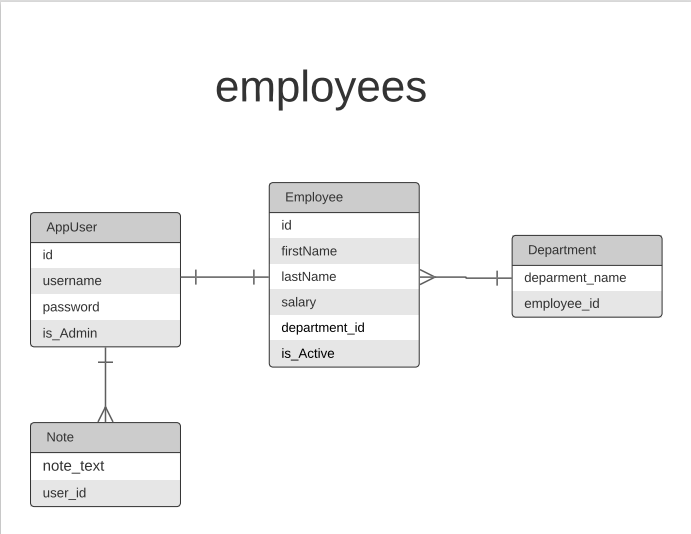

# switch_task

## Web service to handle employees

### Made By: Areej Obaid

### - Check the file to learn more about the requirements =>  [Task Requirements](https://drive.google.com/file/d/1X-yXeJw4FegF9ADyUYsFUfJ8IlXXxAqN/view?usp=sharing)

### - Note: I have completed the task perfectly, and I have added extra features as follows to improve the users's experince:

* I created a table for departments, and added a one-to-many relationship between the department table and the employee table.
* I created the app_user table, and added a one-to-one relationship between the employee table and the app_user table.
* The app_user table contains information such as username, password, and is_adimn.
* After the admin adds a new employee, the system will automatically add the new_app user with username equal finstname + lastname and password equal username and a random number between 0 and 1000.
* The app_user table helps the employee to login, after logging in the employee can add or see his notes.
* I also created a note table with many to one relationship with the employee table.
* To make the login process easier, I used JWT authentication spring boot, using the data in the app_user table.
* Using is_admin in the app_user table defines the permissions of the employee so that no employee can add, modify, remove, or search by name or department for an employee as long as he is not an admin.
* The admin can also search for employees who have a salary equal or higher than the input salary.
* The admin can also add a department.
* The admin can see all departments.
* After logging in, an employee can add or see his notes.
* The ADMIN can search for active and not active employees.
* The admin can see all the employees.
* The admin can update the salaries based on a ratio.

### - To start using the application you need to:

* Clone the repository => `git clone https://github.com/areejobaid94/switch_task.git`

* Start you psql server before run the code.

* Run the application by run the following command in a terminal window (in the complete) directory: `./gradlew bootRun`, or you can open the application in IntelliJ and run it from there.

* Run the test by open the application in IntelliJ and run the test from there.

* You can also use this postman-collection to test the APIs [Link](https://drive.google.com/file/d/1BhtA3YD0yQrvN0aeu1RFg7mVxUC_AAXv/view?usp=sharing).

### - ER diagram for the SQL database

### - Table of all API's

| The API | HTTP request method | The Usage | Notes |
|---------| ------------------- |-----------|-------|
| '/login' | Post | login using password and username |-|
| '/department' | Post | Add department | You need to login as an admin and also to send the token in the header. |
| '/departments' | Get | Get All departments | You need to login as an admin and also to send the token in the header. |      
| '/employee' | Post | Add an employee | You need to login as an admin and also to send the token in the header. |
| '/employee/{id}' | Delete | Delete an employee | You need to login as an admin and also to send the token in the header. |
| '/employee' | Put | Update an employee | You need to login as an admin and also to send the token in the header. |
| '/active_employee' | Get | Get all active or not active employees | You need to login as an admin and also to send the token in the header. |
| '/employees' | Get | Get all employees | You need to login as an admin and also to send the token in the header. |
| '/search_employees' | Get | Search for employees using firstname or/and lastname or/and department | You need to login as an admin and also to send the token in the header. |
| '/salary_employee' | Get | Search for employees depending on the salary, get employees with salary more than or equal a certain value | You need to login as an admin and also to send the token in the header. |
| '/salary_employee' | Put | Update the salary using a certain ratio | You need to login as an admin and also to send the token in the header. |
| '/notes' | Get | Get logged in employee notes | You need to login, also you need to send the token in the header. |
| '/note' | Post | Add a note | You need to login, also you need to send the token in the header. |
